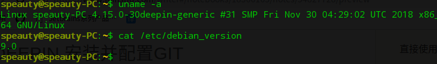
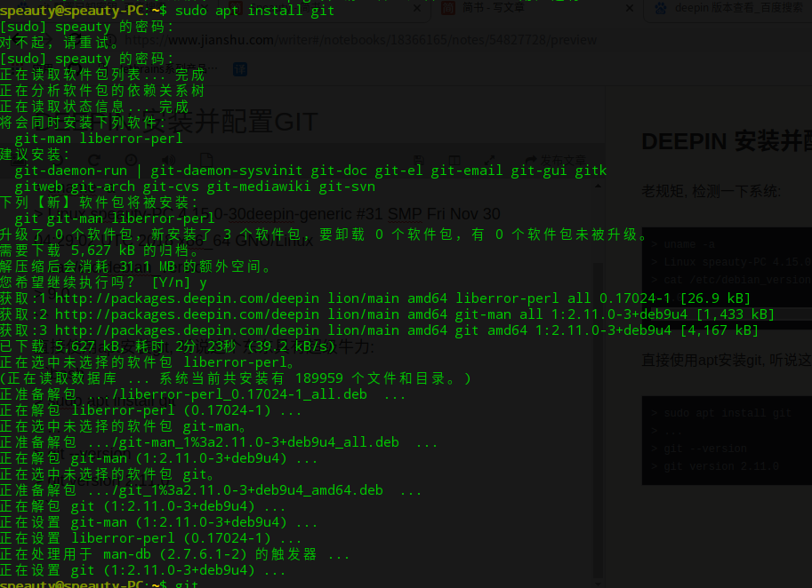
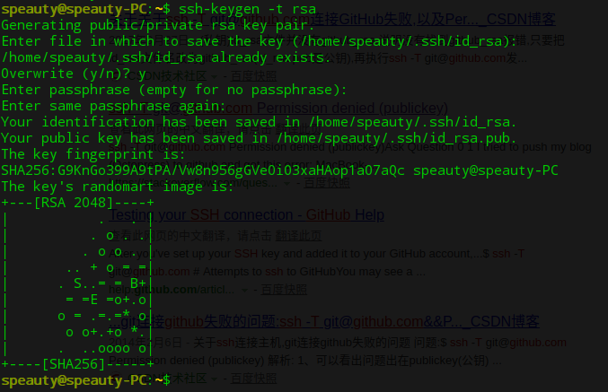
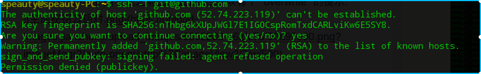
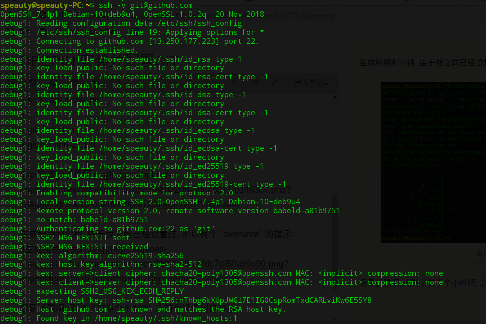
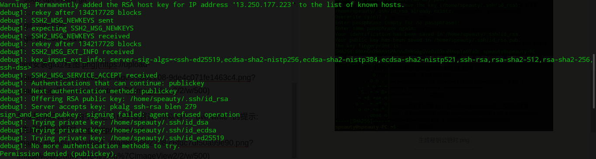
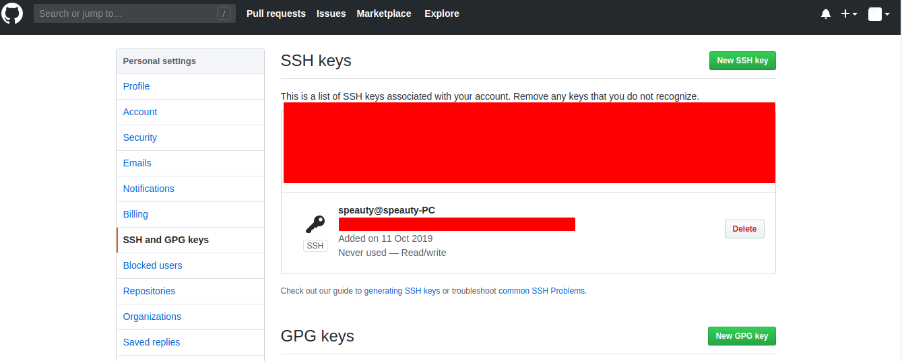
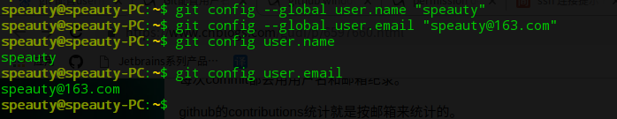

老规矩, 检测一下系统: 
```bash
> uname -a
> Linux speauty-PC 4.15.0-30deepin-generic #31 SMP Fri Nov 30 04:29:02 UTC 2018 x86_64 GNU/Linux
> cat /etc/debian_version
> 9.0
```


直接使用apt安装git, 听说这个东东具有超级牛力:
```bash
> sudo apt install git
> ...
> git --version
> git version 2.11.0
```


生成秘钥和公钥, 由于我之前已经设置过, 所以有个 `overwrite` 的提示:


很是折腾啊, 刚整了有半个小时吧, 之前也没遇到这种事:







由于跟踪有点长, 只好分成了两张, 其中重新生成了秘钥很多, 甚至采用过dsa格式, 不过github那边似乎不支持. 导致该问题的主要原因是未将自定义名称的秘钥加入ssh中, 检索失败. 可使用ssh-add 秘钥地址 `ssh-add ~/.ssh/id_rsa`, 然后使用 `ssh-add -l` 查看秘钥列表.


经过上面处理后, 就可以测试通了:


是不是还忘了什么?  是了, 在github上添加公钥, 将后缀为pub文件的内容复制过去即可:



还有git的配置, 其实大多也就是配个名称和邮箱:




