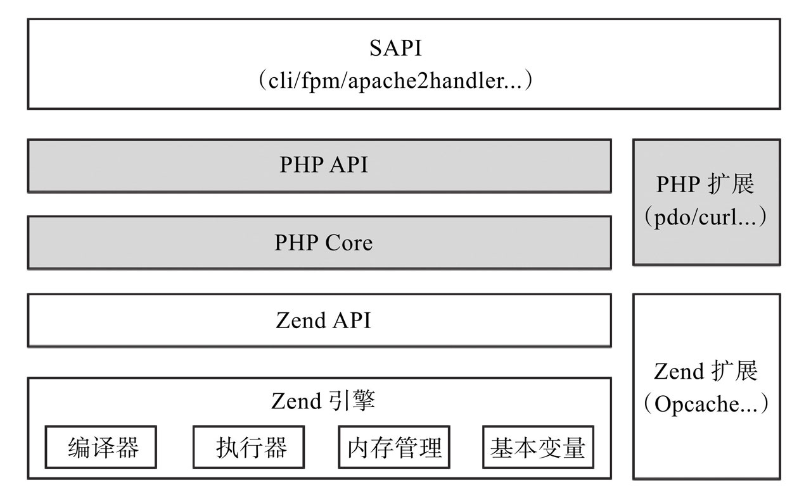

#### PHP源码学习 {docsify-ignore}

空闲之余, 持续学习《PHP 7底层设计与源码实现》. 虽然最近PHP 8的消息不少, 不过了解PHP 7的设计也是可以理解. 早有此打算, 断断续续的, 没个正形.

##### 00. 提前准备
* 创建运行容器和本地目录
```bash
// 个人本地源码映射目录为: /E/Docker/SourceCode
docker run -it --privileged=true -p 99:80 -v /E/Docker/SourceCode:/usr/local/src --name PHPSourceCode --init -d --restart=always centos:7
// 下载PHP安装包
cd /usr/local/src
wget http://cn2.php.net/distributions/php-7.1.0.tar.gz
tar -zxf php-7.1.0.tar.gz
```
* 编译安装PHP
```bash
cd php-7.1.0
yum install -y make gcc gcc-devel libxml2-devel
./configure --prefix=/usr/local/src/php-7.1.0/output --enable-fpm
make && make install
cp php.ini-development ./output/lib/php.ini
```
* 安装源码查看软件`Source Insight`, 网上自行查找安装

##### 01. 整体认识

* PHP是一种弱类型**解释型**语言. 弱类型表明, 变量类型不固定, 比如可以将数组赋给原先保存字符串的变量, 这样在计算比较时, 会发生一些类型的隐式转换. 解释型语言是指在源代码不会直接转成机器码, 而是要经过特定的虚拟机翻译, 并且该过程发生在运行过程中. 相对于编译型语言来说, 慢也在这里, 但也比较灵活.

* 执行原理, 主要有以下这几步:

  1. 词法分析([Re2c](http://re2c.org/)): 将源代码转换成Token(有意义的标识, 在PHP源码中php-7.1.0\Zend\zend_language_parser.h可查看对应Token值);
  2. 语法分析([Bison](https://www.gnu.org/software/bison/)): 将Token和合符文法规则(BNF, 巴科斯范式)的代码生成抽象语法树(AST);
  3. AST生成opcode(指令标识, 存在与之对应的句柄, 虚拟机实际执行的是opcode对应的句柄), 被虚拟机执行.

  这里便有这么一个关系: 源代码 => Token => AST => Opcode => 虚拟机 => 机器码. 另外`token_get_all()`可以获取PHP代码被切割后的Token, 输出结果为二维数据`[['token对应的枚举值', '原始字符串', '对应行号']]`

* 接下来, 看个PHP7源码架构, 从中可以知道, Zend/PHP/SAPI等的依赖关系:


* 了解一下源码目录
   * sapi: 对输入输出层的抽象, 主要为了制定PHP提供对外服务的规范, 主要有以下几种: `apache2handler`, `cgi-fcgi`, `fpm-fcgi`和`cli`;
   * Zend: 从上面的源码架构图可以看出, Zend目录是PHP的核心代码;
   * main: SAPI层和Zend层的桥梁;
   * ext: PHP扩展相关的目录;
   * TSRM(): 线程安全资源管理目录.

?> **apache2handler** Apache扩展, 编译后生成动态链接库, 配置到Apache下, 当有http请求到达Apache时, 根据配置会调用此动态链接库, 执行PHP代码, 完成与PHP的交互.

?> **cgi-fcgi** 编译后生成CGI协议的可执行程序, webserver(通常为Apache或Nginx)通过CGI协议把请求传给CGI进程, 执行代码将结果返回给webserver, 退出进程.

?> **fpm-fcgi** fpm全称为FastCGI Process Manager, PHP官方提供的FastCGI进程管理器. 以Nginx服务器为例, 当有http协议请求发送到Nginx服务器, Nginx按照FastCGI协议把请求交给php-fpm进程处理.

?> **cli** Command Line Interface的简称, PHP的命令行交互接口.

?> **TSRM** Thread Safe Resource Manager线程安全资源管理器的简称, 主要是为了保证共享资源的安全, 在多线程环境下, 为每个线程提供独立的全局变量副本. 具体实施是通过TSRM为每个线程分配(分配前加锁)一个独立ID(自增)作为当前线程的全局变量内存区索引, 在以后的全局变量访问中, 实现线程之间的完全独立.

##### 02. 基本变量

* 联合体(union)是成员变量共享一块内存, 可以根据使用确定含义; 而结构体(struct)是成员变量不共享一块内存的, 并且存在对齐问题.

* 堆栈基础
   * 栈区(stack): 存储参数值, 局部变量, 维护函数调用关系等, 随着局部空间的销毁而销毁, 由系统负责;
   * 堆区(heap): 动态内存区域, 随时申请和释放, 程序需要自行处理其生命周期;
   * 全局区(静态区): 存储全局和静态变量;
   * 字面量区: 常量字符串存储区;
   * 程序代码区: 存储二进制代码.
   
* `zval`结构体(PHP7)

   在`Zend/zend_types.h`中定义

   ```c
   /**
    * zend_value 联合体 8 字节
    * 复杂类型均采用指针操作, 例如字符串等
    */
   typedef union _zend_value {
       /* 整型 */
   	zend_long         lval;				/* long value */
       /* 浮点型 */
   	double            dval;				/* double value */
       /* 引入计数 */
   	zend_refcounted  *counted;
       /* 字符串类型 */
   	zend_string      *str;
       /* 数组类型 */
   	zend_array       *arr;
       /* 对象类型 */
   	zend_object      *obj;
       /* 资源类型 */
   	zend_resource    *res;
       /* 引用类型 */
   	zend_reference   *ref;
       /* 抽象语法树 */
   	zend_ast_ref     *ast;
       /* zval类型 */
   	zval             *zv;
       /* 指针类型 */
   	void             *ptr;
       /* class类型 */
   	zend_class_entry *ce;
       /* 函数类型 */
   	zend_function    *func;
   	struct {
   		uint32_t w1;
   		uint32_t w2;
   	} ww;
   } zend_value;
   
   /**
    * zval结构体: 由zend_value和两个联合体构成 16 字节
    */
   struct _zval_struct {
   	zend_value        value;			/* value */
       /* 4 字节 */
   	union {
   		struct {
   			ZEND_ENDIAN_LOHI_4(
                   /* 记录变量类型 */
   				zend_uchar    type,			/* active type */
                   /**
                    * 对应变量类型特有标记
                    * 常量类型
                    * #define IS_TYPE_CONSTANT			(1<<0)
                    * 不可变类型, 比如存在共享内存中的数组
   				 * #define IS_TYPE_IMMUTABLE	    (1<<1)
   				 * 需要引用计数的类型
   				 * #define IS_TYPE_REFCOUNTED		(1<<2)
   				 * 可能包含循环引用的类型(IS_ARRAY, IS_OBJECT)
   				 * #define IS_TYPE_COLLECTABLE		(1<<3)
   				 * 可被复制的类型
   				 * #define IS_TYPE_COPYABLE			(1<<4)
                    */
   				zend_uchar    type_flags,
                   /* 常量类型标记 */
   				zend_uchar    const_flags,
                   /* 保留字段 */
   				zend_uchar    reserved)	    /* call info for EX(This) */
   		} v;
   		uint32_t type_info;
   	} u1;
       /* 4 字节 */
   	union {
           /* 用来解决哈希冲突, 记录冲突的下一个位置 */
   		uint32_t     next;                 /* hash collision chain */
           /* 运行时缓存. 在执行函数时会优先去缓存中查找, 若缓存中没有, 会在全局的function表中查找 */
   		uint32_t     cache_slot;           /* literal cache slot */
           /* 文件执行的行号, 应用在AST节点上 */
   		uint32_t     lineno;               /* line number (for ast nodes) */
           /* 函数调用时传入参数的个数 */
   		uint32_t     num_args;             /* arguments number for EX(This) */
           /* 遍历数组时的当前位置 */
   		uint32_t     fe_pos;               /* foreach position */
           /* 跟fe_pos类似, 只是针对对象 */
   		uint32_t     fe_iter_idx;          /* foreach iterator index */
           /* 对象类的访问标志, 常用的标识由public,protected,private */
   		uint32_t     access_flags;         /* class constant access flags */
           /* 防止类中魔术方法的循环调用, 比如__get和__set等 */
   		uint32_t     property_guard;       /* single property guard */
   	} u2;
   };
   ```

* 变量类型(在`Zend/zend_types.h`中定义)

   ```c
   /* regular data types(常规数据类型) */
   /**
    * 标记未使用类型, 表示数据可以被覆盖或删除
    * 比如在对数组元素unset操作时, PHP7并不会直接将数据从分配给HashTable的内存中删除, 而是先将该元素所在的Bucket的位置标记为IS_UNDEF, 当HashTable中IS_UNDEF元素到达一定阈值时, 进行refresh操作时再将IS_UNDEF标记的元素覆盖或删除
    */
   #define IS_UNDEF					0
   /* NULL类型 */
   #define IS_NULL						1
   /* 布尔false类型 */
   #define IS_FALSE					2
   /* 布尔true类型 */
   #define IS_TRUE					3
   /* 长整型 */
   #define IS_LONG					4
   /* 浮点型 */
   #define IS_DOUBLE				5
   /* 字符串类型 */
   #define IS_STRING				6
   /* 数组类型 */
   #define IS_ARRAY					7
   /* 对象类型 */
   #define IS_OBJECT				8
   /* 资源类型 */
   #define IS_RESOURCE				9
   /* 参考类型(内部使用) 处理& */
   #define IS_REFERENCE				10
   
   /* constant expressions(常量类型) */
   /* 常量类型 */
   #define IS_CONSTANT				11
   /* 常量类型的AST树 */
   #define IS_CONSTANT_AST			12
   
   /* fake types(伪类型) */
   #define _IS_BOOL					13
   /* 可回调 */
   #define IS_CALLABLE				14
   /* 可迭代 */
   #define IS_ITERABLE				19
   #define IS_VOID					18
   
   /* internal types(内部类型) */
   /* 间接类型 */
   #define IS_INDIRECT             	15
   /* 指针类型 用来解析value.ptr, 通常用在函数类型上*/
   #define IS_PTR					17
   /* 错误类型 校验zval的类型是否合法 */
   #define _IS_ERROR				20
   ```

* 整型和浮点型是在zval中直接存储的, 比如`zval_int(u1.v.type=IS_LONG,value.lval=1)`, 或者`zval_float(u1.v.type=IS_DOUBLE,value.dval=1.0)`等.

?> 全局变量是在程序的任何一处都可以使用的变量. 在PHP底层维护了全局的符号表, 本身是一个HashTable, PHP代码中的全局变量都维护在这个HashTable中, 符号表的作用域就是整个PHP代码.

?> 局部变量是在函数内部定义说明的. 函数的调用过程是不断地压栈和出栈, 出栈后内部变量被销毁, 因此其作用域仅在函数内, 离开函数后使用这种变量是非法的.


##### 03. 字符串

* `_zend_string`结构体

  ```c
  struct _zend_string {
      /* 64-bit 内嵌的gc引用计数及字符串类别存储 */
  	zend_refcounted_h gc;
      /**
       * 64-bit 字符串的哈希值
       * 缓存字符串的哈希值
       * 只有当字符串需要被作为数组key时才会初始化
       * 同一个字符串被多次当作key使用时, 不会重复计算其对应的哈希值
       * 数组计算key对应的索引值会用到h字段
       */
  	zend_ulong        h;                /* hash value */
      /**
       * 64-bit 字符串的长度
       * 时间换空间: 直接记录以避免重复计算字符串的长度
       * 保证了PHP字符串操作二进制安全(读取数据长度以自身结构体len值为准, 不再将\0作为字符串结尾)
       */
  	size_t            len;
      /**
       * 1-bit(会对齐到64-bit) 柔性数组, 字符串的值存储位置
       * 柔性数组val字段占用了末尾连续的一块内存, 用于存储不定长的字符串值
       * struct中字符串的值和其他成员便存储在同一块连续的空间中, 在分配释放内存时便可将struct当成整体处理
       * val[1]占位为了兼容不同版本的C编译器
       */
  	char              val[1];
  };
  
  /* 64-bit */
  typedef struct _zend_refcounted_h {
      /* 引用计数的值存储 */
  	uint32_t         refcount;			/* reference counter 32-bit */
      /* 32-bit */
  	union {
  		struct {
  			ZEND_ENDIAN_LOHI_3(
                  /* 等同于 zval.u1.v.type */
  				zend_uchar    type,
                  /* 字符串的类型数据 */
  				zend_uchar    flags,    /* used for strings & objects */
                  /* 垃圾回收标志颜色 */
  				uint16_t      gc_info)  /* keeps GC root number (or 0) and color */
  		} v;
  		uint32_t type_info;
  	} u;
  } zend_refcounted_h;
  ```

* `zend_string API`

  > 基于`zend_string`结构体封装的各类字符串操作函数集合, 主要有字符串的扩容, 截断, 初始化, 销毁, 判等, 计算哈希值等函数.

```c

/** 初始化CG(interned_strings)内部字符串存储哈希表, 并把PHP的关键字等字符串写进去 */
zend_interned_strings_init

/** 把一个zend_string写入CG(interned_stings)哈希表中, 若已存在数据, 则返回它, 否则写入当前数据并返回 */
zend_new_interned_string_init

/** 把CG(interned_strings)哈希表中的字符串全部标识成永久字符串, 注意, 标识的时候只有PHP的关键字, 内部函数名, 内部方法名等 */
zend_interned_strings_snapshop_init

/** 销毁CG(interned_strings)哈希表中字符类型非永久字符串的值, 在php_request_shutdown阶段释放 */
zend_interned_strings_restore_init

/** 销毁整个CG(interned_strings)哈希表, 在php_mmodule_shutdown阶段触发 */
zend_interned_strings_dtor

/** 得到字符串的哈希值, 若没有, 则实时计算并存储 */
zend_string_hash_val

/** 哈希值置为0 */
zend_string_forget_hash_val

/** 读取字符串引用计数 */
zend_string_refcount

/** 引用计数+1 */
zend_string_addref

/** 引用计数-1 */
zend_string_delref

```
