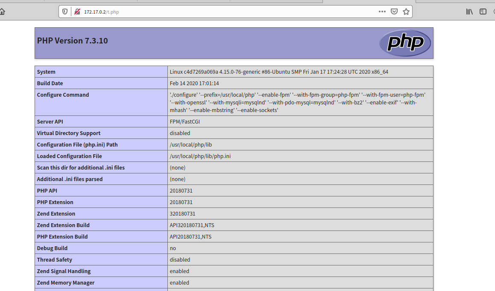
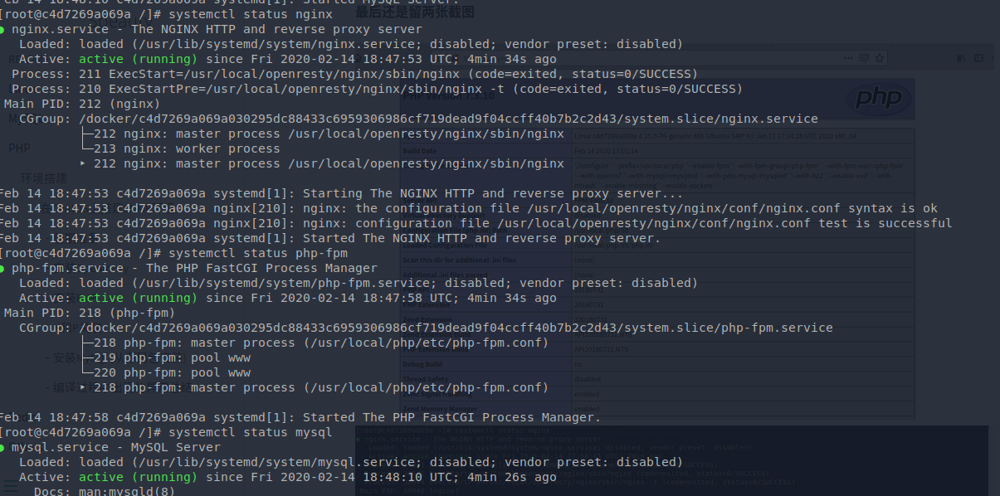

#### 在CentOS上搭建LNMP环境
> 本测试基于Docker CentOS:7

##### 前期准备
拉取镜像并运行容器
```shell script
> docker pull centos:7
> docker run -it --privileged --name web centos:7 /usr/sbin/init
```
更新云源
```shell script
> yum install -y wget
> mv /etc/yum.repos.d/CentOS-Base.repo /etc/yum.repos.d/CentOS-Base.repo.backup
> wget -O /etc/yum.repos.d/CentOS-Base.repo http://mirrors.aliyun.com/repo/Centos-7.repo
> yum clean all
> yum makecache
> yum update -y
```
配置基础依赖库
```shell script
> yum install -y perl pcre pcre-devel openssl openssl-devel gcc gcc-c++ curl libaio m4 autoconf libxml2 libxml2-devel bzip2 bzip2-devel glibc-headers make
```
添加用户
```shell script
> groupadd nginx
> useradd nginx -g nginx -s /sbin/nologin -M
> groupadd php-fpm
> useradd php-fpm -g php-fpm -s /sbin/nologin -M
> groupadd mysql
> useradd mysql -g mysql -s /sbin/nologin -M
```
##### 安装OpenResty
编译安装
```shell script
> wget https://openresty.org/download/openresty-1.15.8.2.tar.gz
> tar -zxf openresty-1.15.8.2.tar.gz
> cd openresty-1.15.8.2
> ./configure --prefix=/usr/local/openresty --group=nginx --user=nginx
> gmake
> gmake install 
```
更新运行用户
```shell script
# 将 #user nobody 改为 user nginx nginx && 去掉 pid 前的注释
> vim /usr/local/openresty/nginx/conf/nginx.conf
```
配置服务
```shell script
> vim nginx.service
> cp nginx.service /lib/systemd/system/ 
> systemctl start nginx
> systemctl enable nginx
```

测试一下
* 可在容器内, 直接访问: `curl 127.0.0.1`
* 可在宿主机上输入容器地址访问: `docker inspect c4d7269a069a|grep IPAddress` 可查看镜像的地址

个性化配置
```shell script
# 将 #user nobody 改为 user nginx nginx && 去掉 pid 前的注释
> vim /usr/local/openresty/nginx/conf/nginx.conf
# error_log  logs/error.log => /var/log/nginx/error.log
# pid /run/nginx.pid => /run/nginx.pid
> vim /usr/lib/systemd/system/nginx.service
# PIDFile=/run/nginx.pid
> systemctl daemon-reload
> mkdir /var/log/nginx
```

##### 安装PHP
编译安装
```shell script
# 由于宿主机有源码包, 直接拷贝过去即可使用, 具体命令如下所示(在宿主机上操作)
> docker cp php-source-path CONATINER-ID:target-dir
> docker cp php-7.3.10.tar.bz2 c4d7269a069a:/root
# 如果本地没有, 可通过一下命令下载(下载很慢, 需要有点耐心)
> wget https://www.php.net/distributions/php-7.3.10.tar.bz2
> tar -jxf php-7.3.10.tar.bz2
> cd php-7.3.10
> ./configure --prefix=/usr/local/php --enable-fpm --with-fpm-group=php-fpm --with-fpm-user=php-fpm --with-openssl --with-mysqli=mysqlnd --with-pdo-mysql=mysqlnd --with-bz2 --enable-exif --with-mhash --enable-mbstring --enable-sockets
> make
> make install 
```
拷贝各种配置文件
```shell script
> cp php.ini-development /usr/local/php/lib/php.ini
> cp /usr/local/php/etc/php-fpm.conf.default /usr/local/php/etc/php-fpm.conf
# 并将其中的pid改为: pid = /run/php-fpm.pid, 大概在17行

> cp /usr/local/php/etc/php-fpm.d/www.conf.default /usr/local/php/etc/php-fpm.d/www.conf
# 做以下修改
# 大概在23行: user = php-fpm
# 大概在24行: group = php-fpm
# 大概在36行: listen = /run/php-fpm.sock
# 大概在48行: listen.owner = php-fpm
# 大概在49行: listen.group = php-fpm
# 大概在50行: listen.mode = 0666
```
配置服务
```shell script
> vim php-fpm.service
> cp php-fpm.service /usr/lib/systemd/system
> systemctl start php-fpm
> systemctl enable php-fpm
> systemctl daemon-reload
```
配置环境变量
```shell script
> sudo vim /etc/profile
# export PATH=$PATH:/usr/local/php/bin
# 重启即可, 似乎有点问题, 暂时不可用
```

##### N和P关联
* 添加一个 nginx 转发 php 请求的通用文件
```shell script
> cd /usr/local/openresty/nginx/conf
> vim php-fpm.conf
```
* 添加虚拟站点
```shell script
> vim /usr/local/openresty/nginx/conf/nginx.conf
# 添加server节点
server
{   
    listen 80;
    server_name localhost;
    root /usr/local/wwwroot;
    include php-fpm.conf;
    location / {
        include mime.types;
        default_type application/octet-stream;
    }
} 
```

##### 安装MySQL(从源码包安装)
* 准备源码包
```shell script
# 方式一: 本地拷贝
>  docker cp mysql-5.7.25-linux-glibc2.12-x86_64.tar.gz c4d7269a069a:/root
# 方式二: 网络下载
> wget https://dev.mysql.com/get/Downloads/MySQL-5.7/mysql-5.7.25-linux-glibc2.12-x86_64.tar.gz
```
* 解压源码包
```shell script
> tar -zxf mysql-5.7.25-linux-glibc2.12-x86_64.tar.gz
```
* 移动到目的路径
```shell script
> mv mysql-5.7.25-linux-glibc2.12-x86_64 /usr/local/mysql
```
* 修改拥有者
```shell script
> cd /usr/local/mysql
> chown -R mysql:mysql ./
```
* 初始化
```shell script
> bin/mysqld --initialize --user=mysql --basedir=/usr/local/mysql --datadir=/usr/local/mysql/data
# !!!记住临时密码: A temporary password is generated for root@localhost: /Vw!T1jl)f!C
```
* 非对称加密(RSA)
```shell script
bin/mysql_ssl_rsa_setup --datadir=/usr/local/mysql/data
```
* 准备配置文件
```shell script
> vim my.cnf
> mkdir /etc/mysql
> mv my.cnf /etc/mysql/my.cnf
# 查看 my.cnf 配置文件加载位置顺序
> mysql --help|grep 'my.cnf'
```
* 配置环境变量
```shell script
> sudo vim /etc/profile
# export PATH=$PATH:/usr/local/php/bin
# 重启即可, 似乎有点问题, 暂时不可用
```
* 设置软连接
```shell script
ln -s /usr/local/mysql/bin/mysql /usr/bin
```
* 配置服务
```shell script
> vim mysql.serivce
> cp mysql.service /usr/lib/systemd/system
```
* 修改临时密码
```shell script
# 获取临时密码
> grep 'temporary password' /var/log/mysqld.log
> mysql -uroot -p
# Enter password: 输入之前的临时密码
mysql > show datatables;
> ERROR 1820 (HY000): You must reset your password using ALTER USER statement before executing this statement.
mysql > ALTER USER 'root'@'localhost' IDENTIFIED BY 'root123';
# 刷新权限
mysql > flush privileges;
```
* 创建用户和授权
```shell script
# 创建用户
> create user 'username'@'ip addr' identified by 'passwd';
# 授权
> grant all privileges on dbname.table to 'username'@'ip addr' identified by 'passwd';
# 刷新权限
> flush privileges
```


##### 最后还是留两张截图 {docsify-ignore}



##### 编译过程中出现的异常总结
* /usr/bin/env: perl: No such file or directory: `yum install perl`
* No gmake nor make found in PATH: `yum install make`
* ./configure: error: the HTTP rewrite module requires the PCRE library: `yum install -y pcre-devel`
* error: #error SSE 4.2 not found: `待处理`
* ./configure: error: SSL modules require the OpenSSL library: `yum install -y openssl openssl-devel`
* bash: vim: command not found: `yum install vim`
* Failed to get D-Bus connection: Operation not permitted: `需要特权, 均是在创建指定; 也可以采用init.d实现`
   * 显然这里我是不干的, 直接基于当前容器创建了一个镜像, 然后带上特权(如果初次创建已带上特权, 应该不会遇到这个问题), 创建并运行, 主要操作如下所示:
   ```shell script
    > docker commit -m 'must with privileged' -a 'speauty' CONTAINER-ID web:1
    > docker run -it --privileged --name web web:1 /usr/sbin/init
    > docker exec -it CONTAINER-ID /bin/bash
   ```
* tar (child): bzip2: Cannot exec: No such file or directory: `yum -y install bzip2`
* configure: error: libxml2 not found. Please check your libxml2 installation: `yum -y install libxml2 libxml2-devel`
* configure: error: Please reinstall the BZip2 distribution: `yum -y install bzip2 bzip2-devel`
* connect() to unix:/usr/local/php/var/run/php73-fpm.sock failed (13: Permission denied) while connecting to upstream: `chmod 666 /run/php-fpm.sock`
* libaio.so.1: cannot open shared object file: No such file or directory: `yum -y install libaio libaio-devel`
* libnuma.so.1: cannot open shared object file: No such file or directory: `yum -y install numactl.x86_64`

##### 配置文件
* [nginx.service](../source/nginx.service ':include :type=code :ignore')
* [php-fpm.conf(nginx转发php请求的通用文件)](../source/php-fpm.conf ':include :type=code :ignore')
* [php-fpm.service](../source/php-fpm.service ':include :type=code :ignore')
* [my.cnf](../source/my.cnf ':include :type=code :ignore')
* [mysql.service](../source/mysql.service ':include :type=code :ignore')
