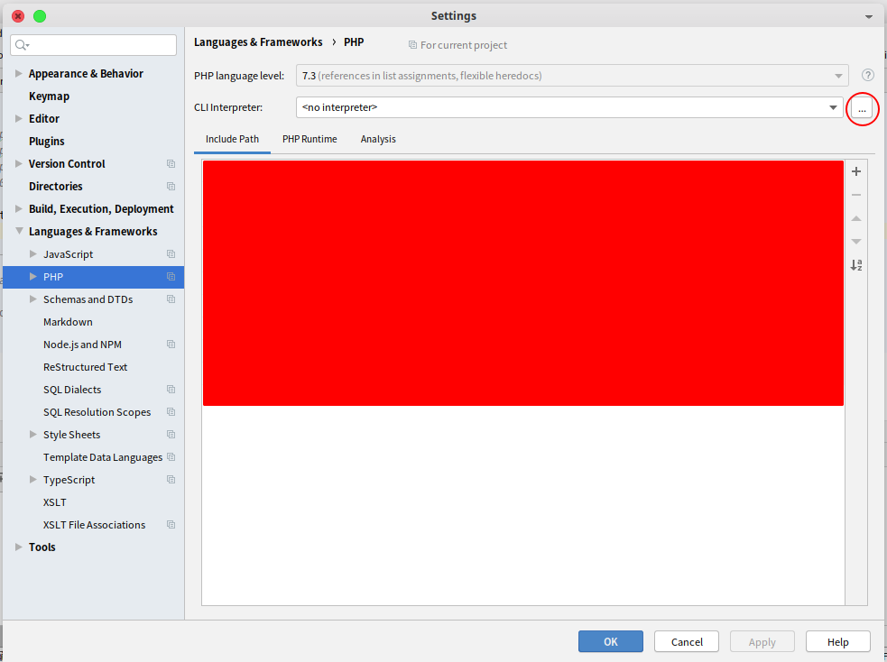
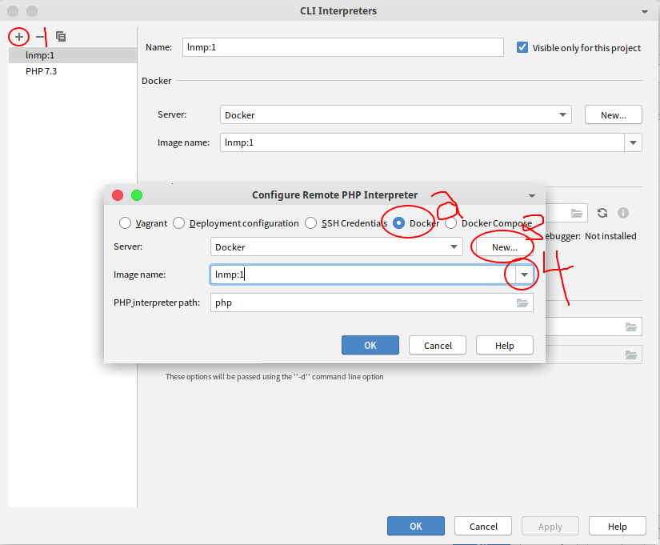
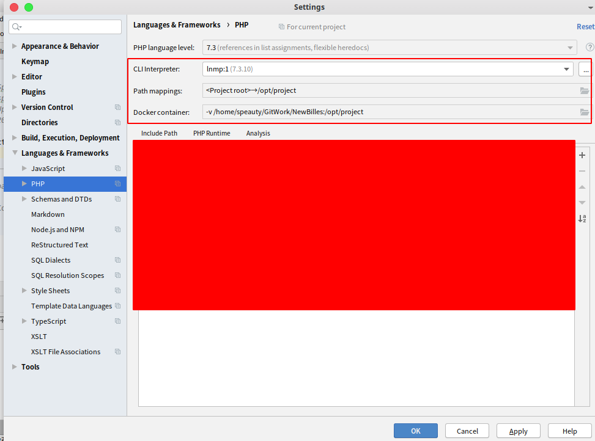

#### 配置Docker中的php解释器 {docsify-ignore}

在phpstorm编辑器中配置Docker中的php解释器, 折腾了一个小时, 最后居然是瞎搞搞出来的. 所以具体原因, 暂时别问我, 不清楚.

* 参考[增加CentOS上搭建LNMP](/php/环境搭建.md?id=在cenos上搭建lnmp环境)将环境搭建好, 只有这样, 才够折腾, 要不然, 就没意思.
* 将当然容器打包成镜像 `docker commit -m 'add some env' -a 'speauty' CONTAINER-ID lnmp:1`
* 重新创建容器 `docker run -it --privileged --name lnmp --env php=/usr/local/php/bin/php --env mysql=/usr/local/mysql/bin/mysql --env nginx=/usr/local/openresty/nginx/sbin/nginx lnmp:1 /usr/sbin/init`
   * 不知道为啥, 到最后, 总会卡起, 然而容器已经创建好了.
* 打开phpstorm, 跟着我一起来
   * 左手一个 `Ctrl` + `Alt` , 右手一个 `s`, 然而我这边快捷键有冲突.
   * 不慌, `File` => `Settings` , 也可打开配置面板.
   * 找到对应配置 `Languages & Frameworks` => `PHP`
   * 以下就是操作的示意图, 看不懂也别问我.
   
   
   
   
不过最后没有测试过, 我想, 应该是可以的. 有空的时候, 再说吧.

刚开始爆出了一个错误: `OCI runtime create failed: container_linux.go:345: starting container process caused \"exec: \\\"/usr/local/php/bin/php\\\": stat /usr/local/php/bin/php: no such file or directory\": unknown` , 经百度, 好像可以添加环境变量, 来解决. 于是, 就有了上面的一系列做法.