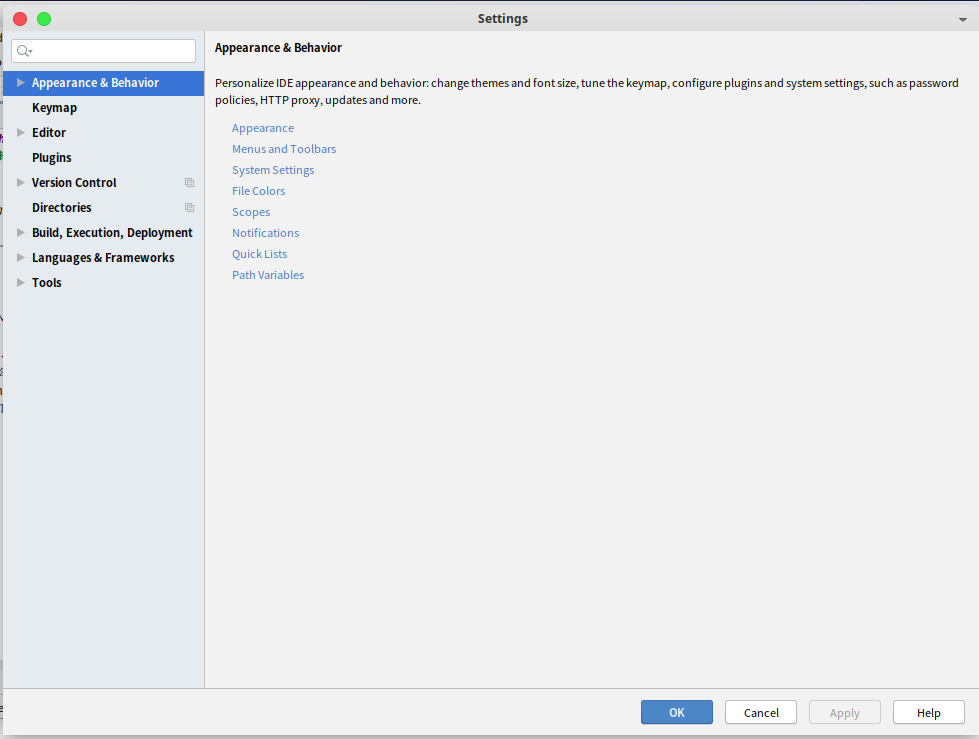
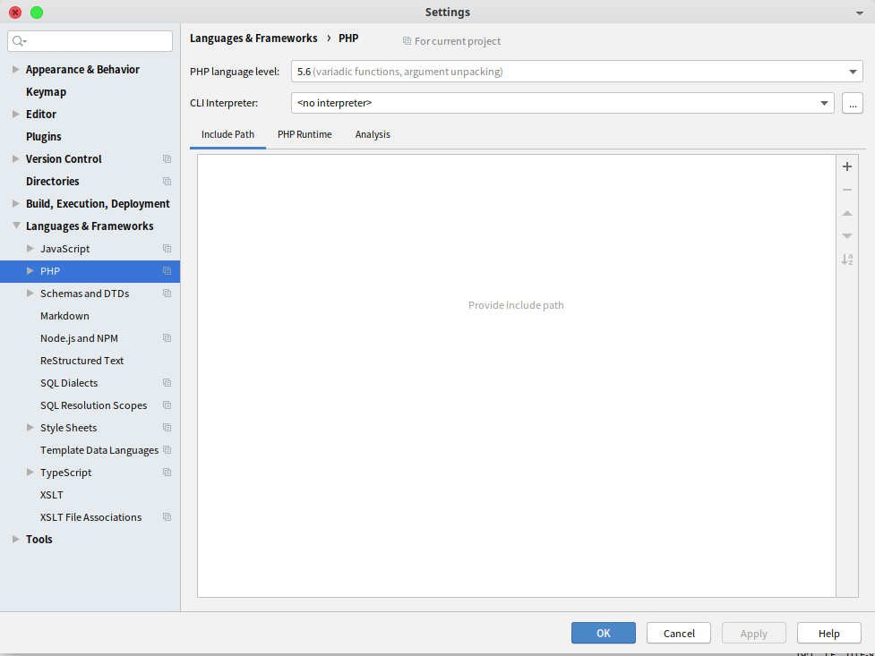
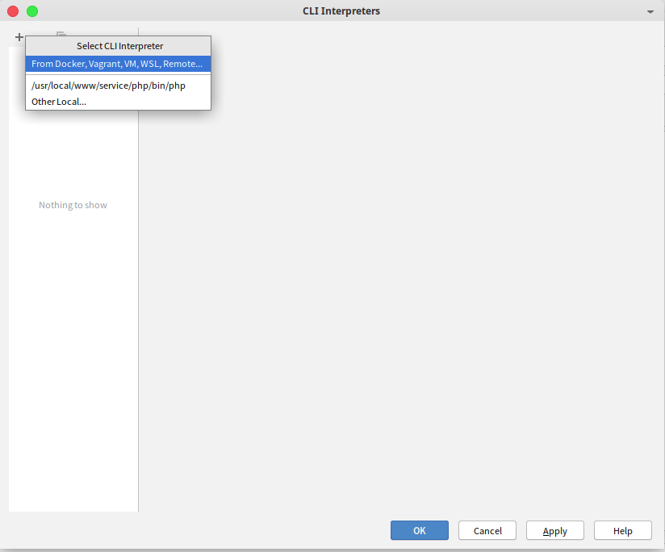
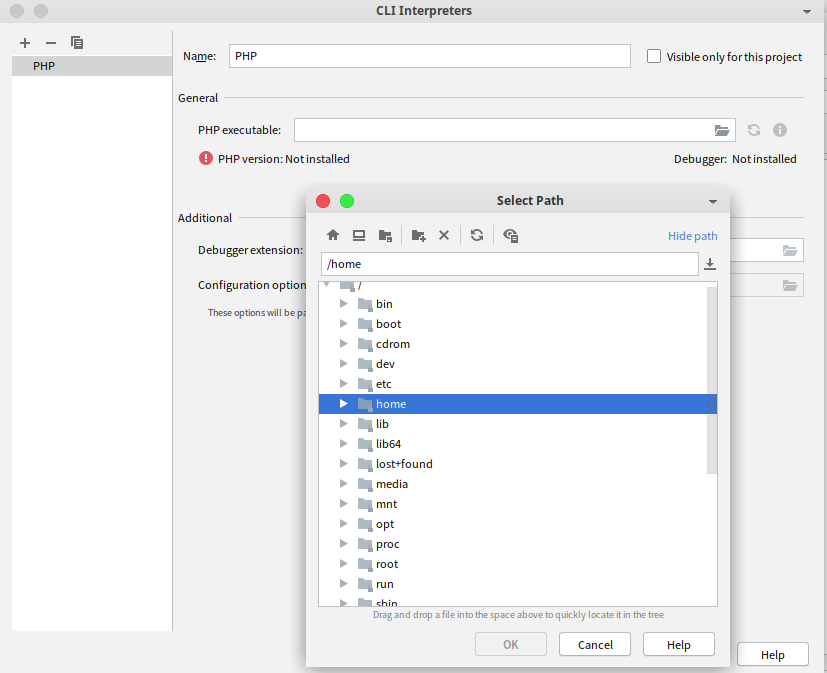
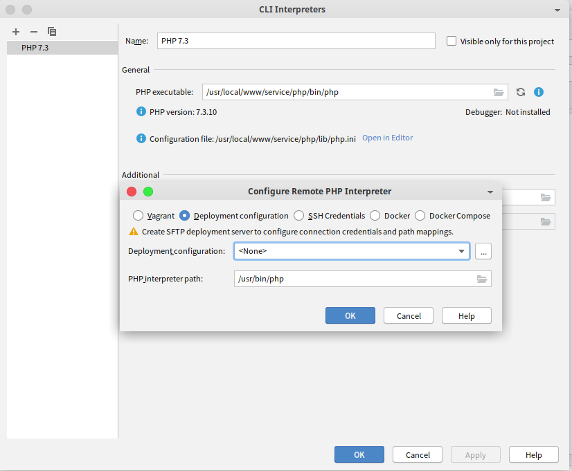
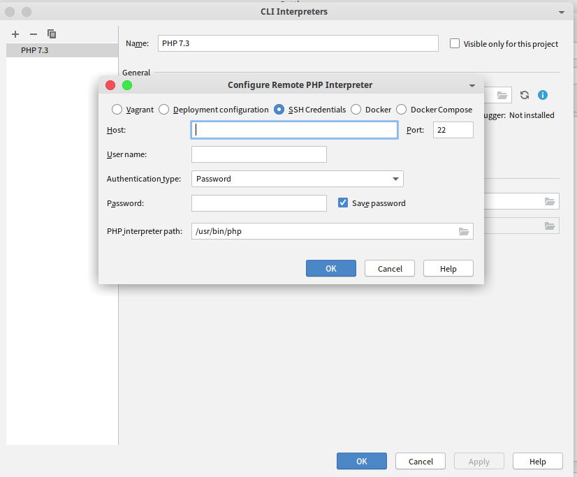
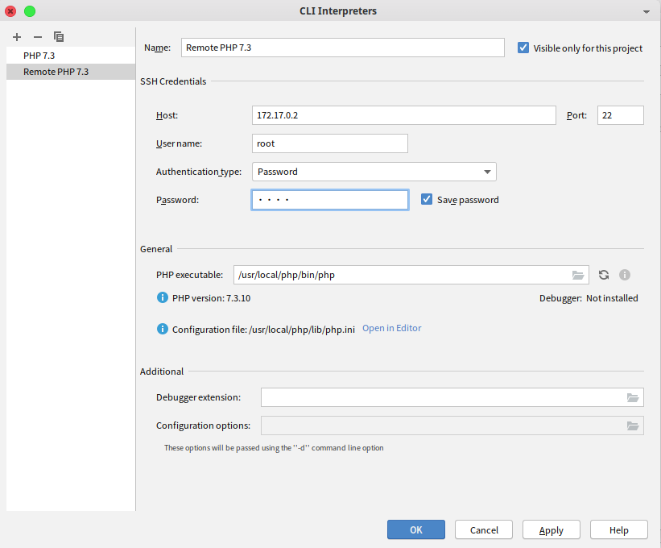
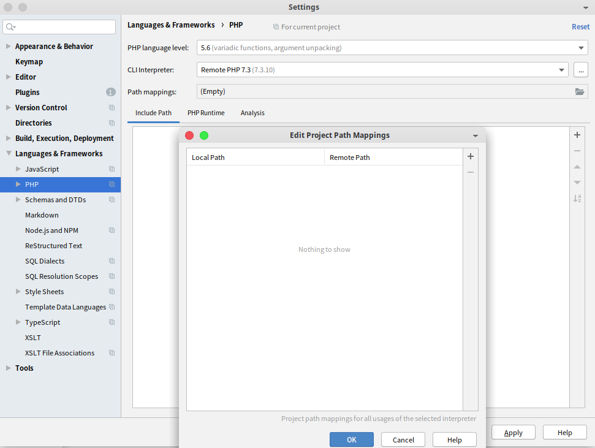

#### 配置远程php解释器 {docsify-ignore}
> 现阶段, 主要针对phpstorm编辑器.

##### 前情提要
不得不先感叹一句, 强人索男, 人啊, 不带这么折腾的. 前面在使用phpstorm时, 已经通过Docker配置好了php解释器. 可谁知昨晚手贱, 一股脑删完了, 包括镜像.只剩下了个CentOS的基础镜像. 

还是心太大, 想一步到位, 然后做个镜像, 上传到网上, 就可以一劳永逸. 然而, 现实就是这么残酷, 配置好了lnmp的docker容器, 在通过docker连接时, 又找不到了. 虽然错误提示能看的懂, 但是不知道怎么去解决它. 真是令人头大.

这时, 灵光一闪, 似乎有人在群里说过用ssh连接, 可以一试, 结果还挺容易的. 别问为什么, 之前我就用phptorm配置过编辑服务器代码, 好像当时用的sftp来着, 时间有些久远. 而且也不怎么这样用.

一脸蒙蔽, 看着八阿哥, 放过我, 好吗? 接下来就是一路惊险逃生历程.

##### 剪不断, 理还乱: 本地php配置
* 既然本地, 那么本地自然要安装php, 才有一续前缘的可能性.
* 打开phpstorm, 看到上面那栏菜单, 点击 `File`.
* 眼光跟着来, 下面有一个 `Settings` 的选项, 对, 点击, 打开设置面板, 也可通过快捷键打开 `Ctrl`+`Alt`+`s`, 由于本地快捷键冲突, 就不做过多展示.

* 大概如上图所示, 接着点击 `Languages & Framewroks`, 在展开的选项中有 `PHP`, 直接点击, 就可以看到下面的截图.

* 点击 `CLI...` 那栏最右的三个点按钮, 看到下图.

   * 选择 `Other Local`, 选择php解释器的路径, 至于显示那个php解释器, 应该是编辑器自动检测识别出来的, 要不就是历史记录, 这个我还真没注意.
   
* 到这里, 就差不多了, 如果这个简单的还不会, 那就直接关机, 出去玩吧, 或者换个编辑器, 推荐vim, 会给你带来不一样的感觉. 相信我的直觉.

##### 穿越时空的爱恋: 还记得ssh吗
* 其实不然, 在添加解释器的时候, 选择第一个你会看到:

* 萌新表示看不懂, 选择上图第三个 `SSH Credentials`, 就不去翻译了, 大概就是基于ssh身份验证的吧, 不信, 就选择它试试, 果然:

* 看吧, 不就是那些吗? 主机, 帐号和认证方式, 我这里选的密码认证, 所以就有密码, 毫不犹豫选择了记住密码, 最下面那个输入就是选择在远程机子上php解释器的路径. 填好之后, 大概是这样的, 点击应用就可以了.

* 点击 `OK` 之后, 就会退到之前那个页面, 看到没, 还有路径映射, 爽不爽? 这有什么用?嘿嘿, 自行体会.

真可谓 `no do no die`, 至于其他的远程配置, 我之后用到, 或者是配置通顺了, 再做记录. 免得被追杀.
